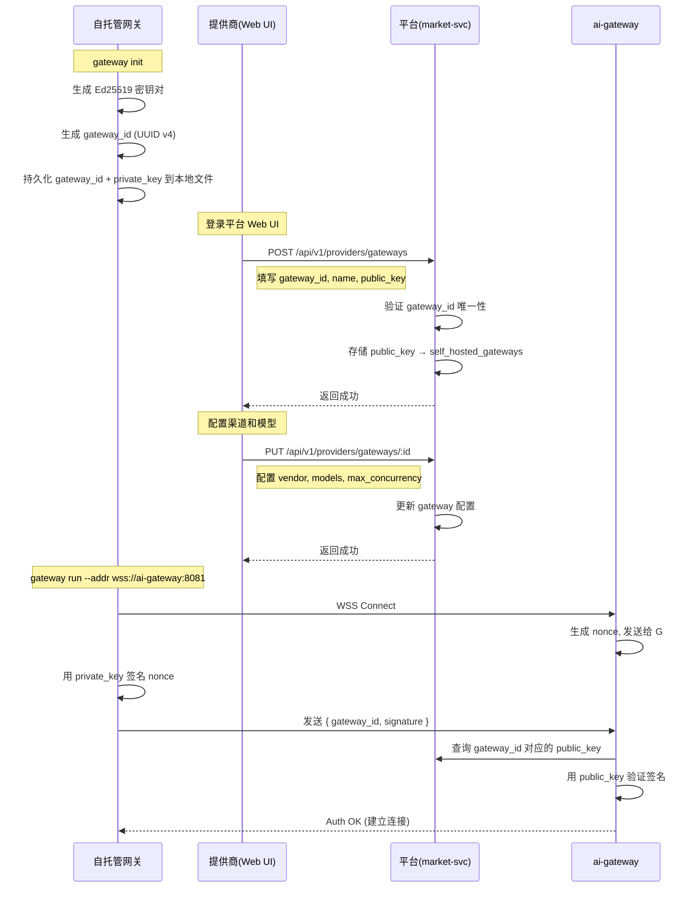

# Token 共享市场 — 实施设计文档

> **版本**: v1.0
> **最后更新**: 2026-05-13

---

## 1. 整体架构

### 服务拓扑

```
┌──────────────────────────────────────────────────────────────────┐
│                        Web Frontend                             │
│                    React SPA (api-gateway 代理)                  │
└──────────┬───────────────────────────────────────────────────────┘
           │ HTTP
┌──────────▼───────────────────────────────────────────────────────┐
│                      api-gateway (HTTP :8080)                    │
│                                                                  │
│  /api/v1/auth/*        → user-svc  (gRPC)                       │
│  /api/v1/balance/*     → asset-svc (gRPC)                       │
│  /api/v1/providers/*   → market-svc (gRPC)     [NEW]             │
│  /api/v1/keys/*        → market-svc (gRPC)     [NEW]             │
│  /api/v1/settlements/* → market-svc (gRPC)     [NEW]             │
│  /api/v1/disputes/*    → market-svc (gRPC)     [NEW]             │
│  /v1/chat/completions  → ai-gateway (HTTP/反向代理)              │
└──────┬──────────┬──────────┬──────────┬──────────────────────────┘
       │ gRPC     │ gRPC     │ gRPC     │ HTTP (LLM)
┌──────▼──┐ ┌────▼────┐ ┌───▼──────┐ ┌─▼──────────────────────────┐
│ user-svc│ │asset-svc│ │market-svc│ │        ai-gateway           │
│ :8100   │ │ :8101   │ │ :8102    │ │        :8081                │
│         │ │         │ │          │ │                             │
│ auth    │ │balance  │ │providers │ │ 虚拟 Key 校验 (读 DB)       │
│ api_keys│ │orders   │ │vkeys     │ │ Provider 路由 (缓存)        │
│         │ │tx       │ │pricing   │ │ WSS 网关枢纽               │
│         │ │deposit  │ │settle    │ │ 写 usage_ledger             │
│         │ │         │ │disputes  │ │ Provider Key 池             │
│         │ │         │ │probes    │ │ 限流                        │
└─────────┘ └─────────┘ └──────────┘ └────────────────────────────┘
                                            │
                                     ┌──────┴──────┐
                                     │  WSS 长连接  │
                                     ▼             ▼
                              ┌──────────┐  ┌──────────┐
                              │ OpenAI   │  │ 自托管    │
                              │ Anthropic│  │ 网关      │
                              │ Gemini   │  │          │
                              │ ...      │  │ 本地模型  │
                              └──────────┘  └──────────┘
```

### 数据流

```
                   市场控制面（api-gateway → market-svc）
                   
提供商注册  → POST /api/v1/providers/register → market-svc
上传 Key   → POST /api/v1/providers/keys       → market-svc → DB
创建虚拟Key → POST /api/v1/keys                → market-svc → DB
日结算     → CRON → market-svc → 从 usage_ledger 聚合 → 生成 settlement_batches
申诉       → POST /api/v1/disputes             → market-svc → DB


                   网关数据面（ai-gateway）

消费者请求 → ai-gateway
  1. 解析虚拟 Key → 读 DB (virtual_keys) 校验
  2. 读缓存 Provider 评分 → 选最优 Provider
  3. 执行请求（托管 Key / WSS 转发）
  4. 写 usage_ledger
  5. 扣消费者余额（调 asset-svc gRPC）
```

---

## 2. 服务边界详情

### market-svc（重构）

**现有 proto 替换为市场管理 API：**

```protobuf
syntax = "proto3";
package market.v1;
option go_package = "ai-platform/api/market/v1;marketv1";

// ===== 提供商管理 =====
service MarketplaceService {
  // 入驻与状态
  rpc RegisterProvider(RegisterProviderReq) returns (RegisterProviderRes);
  rpc GetProviderProfile(GetProviderProfileReq) returns (GetProviderProfileRes);
  rpc UpdateProviderConfig(UpdateProviderConfigReq) returns (UpdateProviderConfigRes);

  // 托管 Key
  rpc CreateProviderKey(CreateProviderKeyReq) returns (CreateProviderKeyRes);
  rpc ListProviderKeys(ListProviderKeysReq) returns (ListProviderKeysRes);
  rpc DeleteProviderKey(DeleteProviderKeyReq) returns (DeleteProviderKeyRes);

  // 定价
  rpc SetPricing(SetPricingReq) returns (SetPricingRes);
  rpc ListPricing(ListPricingReq) returns (ListPricingRes);

  // 虚拟 Key（消费者侧）
  rpc CreateVirtualKey(CreateVirtualKeyReq) returns (CreateVirtualKeyRes);
  rpc ListVirtualKeys(ListVirtualKeysReq) returns (ListVirtualKeysRes);
  rpc UpdateVirtualKey(UpdateVirtualKeyReq) returns (UpdateVirtualKeyRes);
  rpc DeleteVirtualKey(DeleteVirtualKeyReq) returns (DeleteVirtualKeyRes);
  rpc GetVirtualKey(GetVirtualKeyReq) returns (GetVirtualKeyRes);       // 仅返回元数据，不返回 key_hash

  // 结算
  rpc ListSettlements(ListSettlementsReq) returns (ListSettlementsRes);

  // 申诉
  rpc CreateDispute(CreateDisputeReq) returns (CreateDisputeRes);
  rpc ListDisputes(ListDisputesReq) returns (ListDisputesRes);
  rpc SubmitArbitration(SubmitArbitrationReq) returns (SubmitArbitrationRes); // 仲裁方投票
}
```

**依赖：**
- `g.DB()` → `market_svc` 数据库（已有配置）
- 需要 gRPC 客户端连接 `asset-svc`（结算时调用扣费/退款），以及 `user-svc`（验证用户身份）

### ai-gateway（扩展）

**新增数据面功能：**

| 模块 | 说明 |
|------|------|
| `router/provider_router.go` | Provider 路由选择器（基于缓存评分） |
| `router/virtual_key_validator.go` | 虚拟 Key 校验（读 DB 替代 user-svc gRPC） |
| `gateway/wss_hub.go` | WSS 连接管理中心 |
| `gateway/relay.go` | 请求转发（托管 Key / WSS 双模式） |
| `ledger/writer.go` | usage_ledger 写入 |
| `scoring/cache.go` | Provider 评分缓存（每 30s 刷新） |

**依赖：**
- 直接读 `market_svc` 数据库（virtual_keys, provider_keys, provider_pricing, providers）
- 写 `market_svc` 数据库（usage_ledger）
- gRPC 客户端调 `asset-svc`（扣消费者余额）

### api-gateway（扩展）

**新增路由：**

| HTTP | gRPC 后端 | 说明 |
|------|-----------|------|
| `/api/v1/providers/*` | market-svc | 提供商管理 |
| `/api/v1/keys/*` | market-svc | 虚拟 Key |
| `/api/v1/settlements/*` | market-svc | 结算 |
| `/api/v1/disputes/*` | market-svc | 申诉 |
| `/api/v1/admin/*` | market-svc | 平台管理 |

---

## 3. 数据库设计

### ER 概览

```
users
  │
  ├── providers (1:1)              ← 提供商
  │     ├── provider_keys          ← 托管 Key
  │     ├── provider_pricing       ← 定价
  │     └── self_hosted_gateways   ← 自托管网关
  │
  ├── virtual_keys (1:N)           ← 消费者虚拟 Key
  │
  └── usage_ledger (1:N)           ← 统一明细账本
        ├── settlement_batches     ← 结算批次
        └── disputes               ← 申诉
              └── probe_records    ← 探测记录
```

### 完整 DDL

所有新表建在 `market_svc` 数据库中。

```sql
-- ============================================================
-- 1. 提供商表
-- ============================================================
CREATE TABLE providers (
    id BIGSERIAL PRIMARY KEY,
    user_id BIGINT NOT NULL UNIQUE,
    status VARCHAR(32) NOT NULL DEFAULT 'pending',
        -- pending → active → suspended / banned

    -- 押金与日额度
    deposit_amount DECIMAL(20,4) NOT NULL DEFAULT 0,
    daily_quota DECIMAL(20,4) NOT NULL DEFAULT 0,        -- 日服务额度
    daily_used DECIMAL(20,4) NOT NULL DEFAULT 0,          -- 当日已用
    quota_date DATE NOT NULL DEFAULT CURRENT_DATE,        -- 额度归属日期

    -- 评分（由后台定时任务更新）
    score_quality DECIMAL(5,2) NOT NULL DEFAULT 70.00,
    score_price DECIMAL(5,2) NOT NULL DEFAULT 70.00,
    score_reputation DECIMAL(5,2) NOT NULL DEFAULT 70.00,

    -- 可配置参数（由提供商自行设定）
    penalty_rate_first DECIMAL(5,2) NOT NULL DEFAULT 100.00,   -- 首次违规罚款 %
    penalty_rate_repeat DECIMAL(5,2) NOT NULL DEFAULT 200.00,  -- 二次 %
    penalty_rate_third DECIMAL(5,2) NOT NULL DEFAULT 300.00,   -- 三次 %
    arbitrator_count INT NOT NULL DEFAULT 3,                    -- 仲裁人数
    arbitrator_fee_rate DECIMAL(5,2) NOT NULL DEFAULT 20.00,    -- 仲裁方报酬占罚款 %
    partial_refund_rate DECIMAL(5,2) NOT NULL DEFAULT 50.00,    -- 证据不足退款 %

    -- 财务统计
    total_revenue DECIMAL(20,4) NOT NULL DEFAULT 0,
    total_disputes_lost INT NOT NULL DEFAULT 0,
    total_penalty_paid DECIMAL(20,4) NOT NULL DEFAULT 0,

    created_at TIMESTAMP NOT NULL DEFAULT NOW(),
    updated_at TIMESTAMP NOT NULL DEFAULT NOW()
);

CREATE INDEX idx_providers_user_id ON providers(user_id);
CREATE INDEX idx_providers_status ON providers(status);

-- ============================================================
-- 2. 提供商托管 Key（模式 1）
-- ============================================================
CREATE TABLE provider_keys (
    id BIGSERIAL PRIMARY KEY,
    provider_id BIGINT NOT NULL REFERENCES providers(id),
    key_encrypted TEXT NOT NULL,           -- AES 加密存储
    key_last_four VARCHAR(4) NOT NULL,     -- 显示用：sk-...xxxx
    vendor VARCHAR(64) NOT NULL,           -- openai / anthropic / gemini / deepseek
    models TEXT NOT NULL DEFAULT '',       -- 逗号分隔的模型列表
    status INT NOT NULL DEFAULT 1,         -- 1=正常, 0=禁用
    last_checked_at TIMESTAMP,            -- 最近一次可用性检测
    check_result BOOLEAN,                  -- 最近检测结果
    created_at TIMESTAMP NOT NULL DEFAULT NOW(),
    updated_at TIMESTAMP NOT NULL DEFAULT NOW(),
    deleted_at TIMESTAMP
);

CREATE INDEX idx_provider_keys_provider_id ON provider_keys(provider_id);
CREATE INDEX idx_provider_keys_vendor ON provider_keys(vendor);

-- ============================================================
-- 3. 提供商定价
-- ============================================================
CREATE TABLE provider_pricing (
    id BIGSERIAL PRIMARY KEY,
    provider_id BIGINT NOT NULL REFERENCES providers(id),
    model VARCHAR(255) NOT NULL,                       -- gpt-4 / claude-3-opus / ...
    price_per_unit DECIMAL(20,8) NOT NULL,             -- 每 1K tokens 价格（USD）
    unit_type VARCHAR(16) NOT NULL DEFAULT '1k_tokens', -- 计费单位
    status INT NOT NULL DEFAULT 1,
    created_at TIMESTAMP NOT NULL DEFAULT NOW(),
    updated_at TIMESTAMP NOT NULL DEFAULT NOW(),
    UNIQUE(provider_id, model)
);

CREATE INDEX idx_provider_pricing_model ON provider_pricing(model);

-- ============================================================
-- 4. 自托管网关（模式 2）
-- ============================================================
CREATE TABLE self_hosted_gateways (
    id BIGSERIAL PRIMARY KEY,
    provider_id BIGINT NOT NULL REFERENCES providers(id),
    gateway_id VARCHAR(64) NOT NULL UNIQUE,             -- 网关唯一标识
    name VARCHAR(128) NOT NULL DEFAULT '',
    public_key TEXT NOT NULL,                           -- Ed25519 公钥
    status VARCHAR(32) NOT NULL DEFAULT 'offline',      -- online / offline / suspended
    supported_models TEXT NOT NULL DEFAULT '[]',         -- JSON 数组
    max_concurrency INT NOT NULL DEFAULT 100,
    last_heartbeat TIMESTAMP,
    created_at TIMESTAMP NOT NULL DEFAULT NOW(),
    updated_at TIMESTAMP NOT NULL DEFAULT NOW()
);

CREATE INDEX idx_gateways_provider_id ON self_hosted_gateways(provider_id);
CREATE INDEX idx_gateways_status ON self_hosted_gateways(status);

-- ============================================================
-- 5. 虚拟 Key（消费者）
-- ============================================================
CREATE TABLE virtual_keys (
    id BIGSERIAL PRIMARY KEY,
    user_id BIGINT NOT NULL,                             -- 消费者
    name VARCHAR(128) NOT NULL,
    key_hash VARCHAR(255) NOT NULL UNIQUE,               -- sk-xxx 的完整哈希
    key_prefix VARCHAR(16) NOT NULL,                     -- 显示用：sk-xxxxxx...
    routing_rule VARCHAR(32) NOT NULL DEFAULT 'balanced', -- price / speed / quality / balanced
    model_whitelist TEXT,                                -- JSON 数组，NULL = 全部允许
    daily_cap DECIMAL(20,4),                             -- NULL = 不限制
    status INT NOT NULL DEFAULT 1,                       -- 1=启用, 0=禁用
    last_used_at TIMESTAMP,
    created_at TIMESTAMP NOT NULL DEFAULT NOW(),
    updated_at TIMESTAMP NOT NULL DEFAULT NOW(),
    deleted_at TIMESTAMP
);

CREATE INDEX idx_virtual_keys_user_id ON virtual_keys(user_id);
CREATE INDEX idx_virtual_keys_key_hash ON virtual_keys(key_hash);

-- ============================================================
-- 6. 统一明细账本（核心事实表）
-- 每笔 LLM 调用一条记录
-- ============================================================
CREATE TABLE usage_ledger (
    id BIGSERIAL PRIMARY KEY,
    ledger_no VARCHAR(64) NOT NULL UNIQUE,               -- LEDR202605130001

    -- 消费者
    consumer_id BIGINT NOT NULL,
    virtual_key_id BIGINT NOT NULL,

    -- 提供商
    provider_id BIGINT NOT NULL,
    provider_key_id BIGINT,                              -- NULL 时表示走自托管网关
    gateway_id BIGINT,                                   -- NULL 时表示走托管 Key

    -- 用量
    model VARCHAR(255) NOT NULL,
    prompt_tokens INT NOT NULL DEFAULT 0,
    completion_tokens INT NOT NULL DEFAULT 0,
    quota DECIMAL(20,8) NOT NULL,                        -- 实际扣费金额

    -- 路由上下文
    routing_rule VARCHAR(32) NOT NULL,                   -- 消费者当时选的路由规则
    routing_mode VARCHAR(16) NOT NULL,                   -- hosted / selfhosted
    latency_ms INT,                                      -- 响应时间(ms)

    -- 资金明细
    consumer_balance_before DECIMAL(20,4),
    consumer_balance_after DECIMAL(20,4),
    provider_earning DECIMAL(20,8) NOT NULL,             -- 提供商应得（扣抽成前）
    platform_fee DECIMAL(20,8) NOT NULL,                 -- 平台抽成

    -- 状态
    dispute_status VARCHAR(16) NOT NULL DEFAULT 'none',  -- none / disputed / resolved
    dispute_id BIGINT,                                   -- 关联的申诉记录

    -- 时间
    created_at TIMESTAMP NOT NULL DEFAULT NOW()
) PARTITION BY RANGE (created_at);

-- 月度分区示例
CREATE TABLE usage_ledger_202605 PARTITION OF usage_ledger
    FOR VALUES FROM ('2026-05-01') TO ('2026-06-01');
CREATE TABLE usage_ledger_202606 PARTITION OF usage_ledger
    FOR VALUES FROM ('2026-06-01') TO ('2026-07-01');

CREATE INDEX idx_ledger_consumer ON usage_ledger(consumer_id, created_at DESC);
CREATE INDEX idx_ledger_provider ON usage_ledger(provider_id, created_at DESC);
CREATE INDEX idx_ledger_dispute ON usage_ledger(dispute_status) WHERE dispute_status <> 'none';

-- ============================================================
-- 7. 结算批次
-- ============================================================
CREATE TABLE settlement_batches (
    id BIGSERIAL PRIMARY KEY,
    batch_no VARCHAR(64) NOT NULL UNIQUE,                -- STL20260513-0001
    provider_id BIGINT NOT NULL,

    period_start DATE NOT NULL,
    period_end DATE NOT NULL,

    total_amount DECIMAL(20,4) NOT NULL,                 -- 原始流水总额
    platform_fee DECIMAL(20,4) NOT NULL,                 -- 平台抽成
    penalty_amount DECIMAL(20,4) NOT NULL DEFAULT 0,     -- 罚款扣减
    final_amount DECIMAL(20,4) NOT NULL,                 -- 最终结算金额

    status VARCHAR(32) NOT NULL DEFAULT 'pending',       -- pending / frozen / settled / disputed
    dispute_window_end TIMESTAMP,                        -- 申诉截止时间
    settled_at TIMESTAMP,

    created_at TIMESTAMP NOT NULL DEFAULT NOW()
);

CREATE INDEX idx_settlement_provider ON settlement_batches(provider_id);
CREATE INDEX idx_settlement_status ON settlement_batches(status);

-- ============================================================
-- 8. 申诉
-- ============================================================
CREATE TABLE disputes (
    id BIGSERIAL PRIMARY KEY,
    dispute_no VARCHAR(64) NOT NULL UNIQUE,              -- DSP20260513-0001
    usage_ledger_id BIGINT NOT NULL,

    initiator_id BIGINT NOT NULL,                        -- 消费者
    provider_id BIGINT NOT NULL,

    reason TEXT NOT NULL,
    status VARCHAR(32) NOT NULL DEFAULT 'pending',       -- pending / under_review / resolved
    resolution VARCHAR(32),                              -- valid / invalid / partial

    penalty_amount DECIMAL(20,4),                        -- 罚款金额
    compensation_consumer DECIMAL(20,4),                 -- 消费者获赔
    compensation_arbitrator DECIMAL(20,4),               -- 仲裁方报酬
    compensation_platform DECIMAL(20,4),                 -- 平台仲裁手续费

    -- 仲裁详情
    arbitrator_ids TEXT,                                 -- JSON: [1001, 1002, 1003]
    votes TEXT,                                          -- JSON: {"1001": "valid", "1002": "invalid", "1003": "valid"}
    final_verdict TEXT,

    created_at TIMESTAMP NOT NULL DEFAULT NOW(),
    resolved_at TIMESTAMP
);

CREATE INDEX idx_disputes_initiator ON disputes(initiator_id);
CREATE INDEX idx_disputes_provider ON disputes(provider_id);
CREATE INDEX idx_disputes_status ON disputes(status);

-- ============================================================
-- 9. 探测记录
-- ============================================================
CREATE TABLE probe_records (
    id BIGSERIAL PRIMARY KEY,
    target_provider_id BIGINT NOT NULL,
    probed_by VARCHAR(32) NOT NULL DEFAULT 'platform',   -- platform / arbitrator:<id>
    target_model VARCHAR(255) NOT NULL,
    latency_ms INT,
    success BOOLEAN,
    correct BOOLEAN,
    error_message TEXT,
    probed_at TIMESTAMP NOT NULL DEFAULT NOW()
);

CREATE INDEX idx_probe_provider ON probe_records(target_provider_id, probed_at DESC);
CREATE INDEX idx_probe_model ON probe_records(target_model);

-- ============================================================
-- 10. 平台指导价（供计算价格分参考）
-- ============================================================
CREATE TABLE platform_guide_pricing (
    id BIGSERIAL PRIMARY KEY,
    model VARCHAR(255) NOT NULL UNIQUE,
    guide_price DECIMAL(20,8) NOT NULL,                  -- 每 1K tokens 指导价
    updated_at TIMESTAMP NOT NULL DEFAULT NOW()
);

-- ============================================================
-- 11. 平台配置表（阶梯抽成等多项参数）
-- ============================================================
CREATE TABLE platform_config (
    key VARCHAR(128) PRIMARY KEY,
    value JSONB NOT NULL,
    updated_at TIMESTAMP NOT NULL DEFAULT NOW()
);

-- 初始配置
INSERT INTO platform_config (key, value) VALUES
    ('commission_tiers', '[
        {"from": 0, "to": 1000, "rate": 10},
        {"from": 1000, "to": 10000, "rate": 7},
        {"from": 10000, "to": 50000, "rate": 5},
        {"from": 50000, "to": null, "rate": 3}
    ]'),
    ('deposit_multiplier', '{"value": 5}'),
    ('quota_overage_pct', '{"value": 20}');
```

---

## 4. API 接口设计

> 所有 API 通过 api-gateway 暴露，路径前缀 `/api/v1`。
> 认证方式：Bearer token（JWT），从 user-svc 验证。

### 4.1 提供商管理

| 方法 | 路径 | 说明 | 角色 |
|------|------|------|------|
| POST | `/api/v1/providers/register` | 注册为提供商 | consumer |
| GET | `/api/v1/providers/profile` | 获取自己的提供商信息 | provider |
| PUT | `/api/v1/providers/profile` | 更新可配置参数 | provider |
| POST | `/api/v1/providers/deposit` | 缴纳/追加押金 | provider |
| GET | `/api/v1/providers/keys` | 列出托管 Key | provider |
| POST | `/api/v1/providers/keys` | 上传托管 Key | provider |
| DELETE | `/api/v1/providers/keys/:id` | 删除托管 Key | provider |
| GET | `/api/v1/providers/pricing` | 查看自己的定价 | provider |
| PUT | `/api/v1/providers/pricing/:model` | 设置某模型定价 | provider |
| GET | `/api/v1/providers/settlements` | 结算历史 | provider |
| GET | `/api/v1/providers/stats` | 提供商数据概览 | provider |

**注册请求体：**
```json
{
  "deposit_amount": 1000.00
}
```

**上传 Key 请求体：**
```json
{
  "key": "sk-proj-xxxxxxxxxxxx",
  "vendor": "openai",
  "models": "gpt-4,gpt-4-turbo,gpt-3.5-turbo"
}
```

**更新配置请求体：**
```json
{
  "penalty_rate_first": 150.00,
  "arbitrator_count": 5,
  "arbitrator_fee_rate": 25.00
}
```

### 4.2 虚拟 Key（消费者）

| 方法 | 路径 | 说明 | 角色 |
|------|------|------|------|
| POST | `/api/v1/keys` | 创建虚拟 Key | consumer |
| GET | `/api/v1/keys` | 列出我的虚拟 Key | consumer |
| GET | `/api/v1/keys/:id` | 查看单个 Key | consumer |
| PUT | `/api/v1/keys/:id` | 更新 Key 配置 | consumer |
| DELETE | `/api/v1/keys/:id` | 删除虚拟 Key | consumer |
| GET | `/api/v1/keys/:id/usage` | 某 Key 的使用明细 | consumer |

**创建虚拟 Key 请求体：**
```json
{
  "name": "生产环境",
  "routing_rule": "balanced",
  "model_whitelist": ["gpt-4", "claude-3-opus"],
  "daily_cap": 100.00
}
```

**创建响应（只显示一次）：**
```json
{
  "id": 1,
  "name": "生产环境",
  "key": "sk-mp-a1b2c3d4e5f6g7h8i9j0k1l",    // 原始 Key，仅创建时返回
  "key_prefix": "sk-mp-a1b2",
  "routing_rule": "balanced",
  "model_whitelist": ["gpt-4", "claude-3-opus"],
  "daily_cap": 100.00,
  "status": 1,
  "created_at": "2026-05-13T10:00:00Z"
}
```

### 4.3 消费与账单

| 方法 | 路径 | 说明 | 角色 |
|------|------|------|------|
| GET | `/api/v1/usage` | 我的调用记录 | consumer/provider |
| GET | `/api/v1/usage/:id` | 单条明细 | consumer/provider |

### 4.4 申诉

| 方法 | 路径 | 说明 | 角色 |
|------|------|------|------|
| POST | `/api/v1/disputes` | 发起申诉 | consumer |
| GET | `/api/v1/disputes` | 我的申诉列表 | consumer/provider |
| GET | `/api/v1/disputes/:id` | 查看申诉详情 | consumer/provider/arbitrator |
| GET | `/api/v1/arbitrator/disputes` | 待仲裁列表 | arbitrator |
| POST | `/api/v1/arbitrator/disputes/:id/vote` | 提交仲裁投票 | arbitrator |

**发起申诉请求体：**
```json
{
  "usage_ledger_id": 10086,
  "reason": "响应延迟超过 30 秒，SLA 承诺 < 5 秒"
}
```

**仲裁投票请求体：**
```json
{
  "verdict": "valid",         // valid / invalid / partial
  "comment": "提供商历史上已有 3 次延迟超标记录"
}
```

### 4.5 平台管理（Admin）

| 方法 | 路径 | 说明 | 角色 |
|------|------|------|------|
| GET | `/api/v1/admin/providers` | 列出所有提供商 | admin |
| PUT | `/api/v1/admin/providers/:id/approve` | 审核通过 | admin |
| PUT | `/api/v1/admin/providers/:id/suspend` | 暂停 | admin |
| PUT | `/api/v1/admin/providers/:id/ban` | 封禁（扣全部押金） | admin |
| GET | `/api/v1/admin/settlements` | 全部结算 | admin |
| GET | `/api/v1/admin/disputes` | 全部申诉 | admin |
| GET | `/api/v1/admin/stats` | 平台运营数据 | admin |
| PUT | `/api/v1/admin/guide-pricing/:model` | 设置指导价 | admin |

### 4.6 公开接口（无需认证）

| 方法 | 路径 | 说明 |
|------|------|------|
| GET | `/api/v1/models` | 可用模型列表+价格区间 |
| GET | `/api/v1/providers/public` | 所有活跃提供商（评分、定价） |

### 4.7 ai-gateway LLM 接口（虚拟 Key 认证）

| 方法 | 路径 | 说明 |
|------|------|------|
| POST | `/v1/chat/completions` | Chat 补全（OpenAI 兼容） |
| POST | `/v1/completions` | 补全（OpenAI 兼容） |
| POST | `/v1/embeddings` | 向量化（OpenAI 兼容） |
| GET | `/v1/models` | 可用模型列表 |

认证方式：`Authorization: Bearer sk-mp-xxx`（虚拟 Key）

---

## 5. 关键数据流

### 5.1 消费者调用 LLM

```
1. 消费者请求
   POST /v1/chat/completions
   Authorization: Bearer sk-mp-a1b2c3d4
   {"model": "gpt-4", "messages": [...]}

2. ai-gateway
   a. 解析 Key，从 DB 查 virtual_keys（key_hash）
   b. 校验：Key 状态、余额、日额度、模型白名单
   c. 从缓存读 Provider 评分
   d. 按 routing_rule 排分选最优 Provider
   e. 检查 Provider 日额度是否够用
   f. 执行：托管 Key → 直接调厂商 API | 自托管 → WSS 转发
   g. 写入 usage_ledger
   h. 扣消费者余额（调 asset-svc gRPC）
   i. 累加 Provider 日已用额度

3. 返回给消费者（流式/非流式）
```

### 5.2 日结算

```
1. CRON 触发（UTC 00:00）
2. market-svc 查询 usage_ledger
   WHERE provider_id = ? AND created_at >= period_start AND created_at < period_end
     AND dispute_status = 'none'
3. 聚合计算：
   - total_amount = SUM(quota)
   - platform_fee = 阶梯抽成计算
   - 减去有 dispute 的金额
4. 生成 settlement_batch（status = frozen）
5. 启动 24h 申诉窗口倒计时
6. 窗口到期 → 标记 settled → 通知 asset-svc 执行转账
```

### 5.3 申诉 + 仲裁

```
1. 消费者 POST /api/v1/disputes
2. market-svc:
   a. 标记 usage_ledger.dispute_status = 'disputed'
   b. 生成 disputes 记录（status = pending）
   c. 按信誉分加权随机选 N 名仲裁方（providers 表里 role_mask 含 arbitrator 的用户）
   d. 通知仲裁方
3. 仲裁方各自通过 POST /api/v1/arbitrator/disputes/:id/vote 提交裁决
4. 裁判收集完毕后：
   a. 加权投票统计
   b. 更新 dispute.resolution
   c. 计算赔偿/罚款 （按提供商设定的 penalty_rate）
   d. 更新 settlement_batch（加上罚款扣减）
   e. 更新 providers.score_reputation
```

### 5.4 主动探测

```
1. 定时任务（CRON，每 5 分钟）
2. market-svc / ai-gateway 选一个活跃 Provider
3. 向该 Provider 支持的模型发 benchmark 请求
   a. 选预置测试问题（正确性测试）
   b. 记录延迟
   c. 记录是否成功
4. 写入 probe_records
5. 每 30 秒定时任务更新 providers.score_quality
   FROM probe_records WHERE target_provider_id = ?
   计算：P95 延迟、成功率、正确率 → 质量分
```

---

## 6. 迁移与实施步骤

### 第一阶段：基础建设

1. **重构 market-svc proto** — 用 MarketplaceService 替换旧 listing/trade
2. **更新 api/ 模块** — 重新编译 proto
3. **建表** — 在 market_svc 数据库执行迁移
4. **market-svc 实现** — Provider 注册、押金管理、虚拟 Key CRUD
5. **api-gateway 扩展** — 新增 gRPC client + HTTP 路由

### 第二阶段：网关数据面

6. **ai-gateway 扩展** — Provider 路由选择器（评分缓存）
7. **ai-gateway 扩展** — 虚拟 Key 认证替换（读 DB 替代 user-svc gRPC）
8. **usage_ledger 写入** — 每笔请求记录
9. **托管 Key 模式** — Provider Key 池 + 负载均衡 + 厂商调用

### 第三阶段：高阶功能

10. **WSS 网关枢纽** — 自托管网关注册 + 心跳 + 请求转发
11. **日结算** — 结算批次生成 + 申诉窗口 + 转账
12. **申诉与仲裁** — 完整申诉处理流程
13. **主动探测** — Benchmark + 评分更新

---

## 7. 配置参数一览

### 平台级（platform_config 表）

| Key | 说明 | 初始值 |
|-----|------|--------|
| `commission_tiers` | 阶梯抽成 | `[{from:0, to:1000, rate:10}, ...]` |
| `deposit_multiplier` | 押金倍数 | `5` |
| `quota_overage_pct` | 超额比例 | `20` |

### 提供商级（providers 表字段）

| 字段 | 说明 | 默认值 |
|------|------|--------|
| `penalty_rate_first` | 首次违规罚款 % | 100% |
| `penalty_rate_repeat` | 二次 % | 200% |
| `penalty_rate_third` | 三次 % | 300% |
| `arbitrator_count` | 仲裁人数 | 3 |
| `arbitrator_fee_rate` | 仲裁报酬占罚款 % | 20% |
| `partial_refund_rate` | 证据不足退款 % | 50% |

### 消费者级（virtual_keys 表字段）

| 字段 | 说明 | 可选值 |
|------|------|--------|
| `routing_rule` | 路由偏好 | `balanced / price / speed / quality` |
| `model_whitelist` | 模型白名单 | NULL 或数组 |
| `daily_cap` | 日额度上限 | NULL 或金额 |

---

## 8. 自托管网关注册与路由

### 8.1 网关注册流程



**关键设计点：**

- **网关无状态**：仅本地持久化 `gateway_id` + `private_key`，其余配置（渠道、模型、限流）从平台同步。
- **一个提供商多个网关**：每个网关独立 `gateway_id` + `key_pair`，支持多地部署。
- **公钥仅用于认证**：验证 WSS 连接身份，不用于加密通信。WSS 本身走 TLS。
- **重连安全**：每次 WSS 连接服务端生成新 nonce，防止重放攻击。

### 8.2 Redis 路由架构

#### 8.2.1 设计目标

- 自托管网关与 ai-gateway 之间的连接路由表存储在 Redis 中，避免 ai-gateway 重启后丢失连接状态
- 支持多 ai-gateway 实例水平扩展（每个实例共享同一个 Redis 路由表）
- 快速查找：给定虚拟 Key + 模型 → 找到最优 Provider → 找到对应网关连接
- 自动清理：利用 Redis TTL 处理网关异常断开场景

#### 8.2.2 Redis 数据结构

```
┌─────────────────────────────────────────────────────────────────┐
│  Redis                                                           │
│                                                                  │
│  ┌──────────────────────────────────┐                           │
│  │  Hash: gateway:conn:{connID}    │  连接元数据                 │
│  │  ├── gateway_id                 │                            │
│  │  ├── provider_id                │                            │
│  │  ├── status                     │  connected / authenticating │
│  │  ├── remote_addr                │                            │
│  │  ├── connected_at               │  Unix timestamp             │
│  │  └── TTL: 90s (heartbeat 续期)  │                            │
│  ├──────────────────────────────────┤                           │
│  │  Hash: gateway:by_gwid:{gwId}   │  按网关 ID 查连接          │
│  │  ├── conn_id                    │                            │
│  │  ├── last_heartbeat             │                            │
│  │  └── TTL: 90s                   │                            │
│  ├──────────────────────────────────┤                           │
│  │  Set: gateway:models:{model}    │  支持某模型的所有网关      │
│  │  └── members: [gwId1, gwId2]   │  用于按模型路由             │
│  ├──────────────────────────────────┤                           │
│  │  Set: gateway:by_provider:{pid} │  某提供商的所有网关        │
│  │  └── members: [gwId1, gwId2]   │  用于管理后台查询           │
│  ├──────────────────────────────────┤                           │
│  │  SortedSet: gateway:heartbeat   │  心跳时间戳排序            │
│  │  └── score: timestamp           │  用于检测超时网关          │
│  │      member: gwId               │                            │
│  └──────────────────────────────────┘                           │
└─────────────────────────────────────────────────────────────────┘
```

| 数据结构 | Key 模式 | 用途 | TTL |
|----------|----------|------|-----|
| Hash | `gateway:conn:{connID}` | 连接会话元数据 | 90s（心跳续期） |
| Hash | `gateway:by_gwid:{gatewayId}` | 网关 ID → connID 映射 | 90s（心跳续期） |
| Set | `gateway:models:{model}` | 某模型可用网关列表 | 无（主动增删） |
| Set | `gateway:by_provider:{providerId}` | 提供商的所有网关 | 无（主动增删） |
| SortedSet | `gateway:heartbeat` | 全网关心跳时间排序 | 无（主动清理） |

#### 8.2.3 连接生命周期

```
┌──────────┐          ┌──────────────┐          ┌─────┐
│ 自托管网关 │          │  ai-gateway   │          │Redis│
└────┬─────┘          └──────┬───────┘          └──┬──┘
     │                       │                     │
     │  1. WSS Connect       │                     │
     │──────────────────────►│                     │
     │                       │                     │
     │  2. 发送 Nonce 签名   │                     │
     │──────────────────────►│                     │
     │                       │  3. 验证签名        │
     │                       │  查 DB public_key   │
     │                       │                     │
     │  4. Auth Result       │                     │
     │◄──────────────────────│                     │
     │                       │                     │
     │           === 认证通过后 ===                 │
     │                       │                     │
     │                       │  5. HSET            │
     │                       │  gateway:conn:{cid} │
     │                       │────────────────────►│
     │                       │                     │
     │                       │  6. HSET            │
     │                       │  gateway:by_gwid:xx │
     │                       │────────────────────►│
     │                       │                     │
     │                       │  7. SADD            │
     │                       │  gateway:models:xx  │
     │                       │────────────────────►│
     │                       │                     │
     │                       │  8. SADD            │
     │                       │  gateway:by_provider│
     │                       │────────────────────►│
     │                       │                     │
     │                       │  9. ZADD            │
     │                       │  gateway:heartbeat  │
     │                       │────────────────────►│
     │                       │                     │
     │                       │  10. UPDATE DB      │
     │                       │  status=online      │
     │                       │                     │
     │  === 每 30s 心跳 ===   │                     │
     │──────────────────────►│                     │
     │                       │  11. EXPIRE 续期    │
     │                       │────────────────────►│
     │                       │                     │
     │  === 断开连接 ===      │                     │
     │                       │                     │
     │                       │  12. DEL conn-key   │
     │                       │────────────────────►│
     │                       │  13. DEL gwid-key   │
     │                       │────────────────────►│
     │                       │  14. SREM models    │
     │                       │────────────────────►│
     │                       │  15. SREM provider  │
     │                       │────────────────────►│
     │                       │  16. ZREM heartbeat │
     │                       │────────────────────►│
     │                       │                     │
     │                       │  17. UPDATE DB      │
     │                       │  status=offline     │
     │                       │                     │
```

#### 关键设计点

- **短 TTL + 心跳续期**：90s TTL，每 30s 心跳续期。网关进程崩溃后 90s 内自动过期清理，无需人工介入。
- **双键映射**：`connID → 元数据` 和 `gwID → connID` 两种查询路径，分别支持"按连接查"和"按网关查"。
- **心跳检测后台任务**：ai-gateway 每 60s 扫描 `gateway:heartbeat`，找出超过 90s 未心跳的网关，主动执行清理（SREM + DB 更新）。
- **异常断开兜底**：Redis key 带 TTL 自动过期是兜底手段；正常断开时 ai-gateway 主动清理所有相关 key。两者互补。

#### 8.2.4 ai-gateway GatewayManager

```go
// internal/gateway/manager.go
type GatewayManager struct {
    rdb     *redis.Client     // Redis 客户端
    mu      sync.RWMutex      // 保护内存缓存

    // 内存缓存（读多写少，减少 Redis 压力）
    // key: gatewayId, value: connID
    byGateway   map[string]string
    // key: model, value: set of gatewayId
    modelIndex  map[string]map[string]struct{}
    // key: providerId, value: set of gatewayId
    providerIndex map[string]map[string]struct{}
}
```

**核心方法：**

| 方法 | 说明 | 读/写 |
|------|------|-------|
| `OnConnect(gwID, providerID, models, connID)` | 网关认证通过后建立路由索引 | Redis + 内存写 |
| `OnHeartbeat(gwID)` | 心跳续期 | Redis EXPIRE + 内存更新 |
| `OnDisconnect(connID)` | 网关断开清理路由索引 | Redis + 内存写 |
| `FindGateway(providerID, model)` | 按提供商+模型查找在线网关 | 内存读（miss 后回源 Redis） |
| `GetOnlineGateways(providerID)` | 某提供商所有在线网关 | 内存读 |
| `SelectGateway(ctx, vkey, model)` | 路由选择：按评分选最优网关 | 内存读 + 路由策略 |

#### 8.2.5 路由选择流程

```
消费者请求 POST /v1/chat/completions
  Authorization: Bearer sk-mp-xxx
  {"model": "gpt-4"}

  ↓

1. 解析虚拟 Key
   → 从 DB 查 virtual_keys (key_hash)

2. 校验
   → Key 状态、余额、日额度、模型白名单

3. 确定路由模式
   → virtual_key.routing_rule (price / speed / quality / balanced)

4. 查 Provider 评分缓存
   → 从内存缓存读 providers 评分（每 30s 刷新）

5. 选最优 Provider
   → 按 routing_rule 加权排序

6. 查网关连接
   → GatewayManager.SelectGateway(providerID, model)
   → 从 modelIndex 内存缓存找在线网关

7. 转发
   托管 Key 模式  → 直接调厂商 API（OpenAI / Anthropic / ...）
   自托管模式     → 通过 WSS 连接转发请求

8. 写 usage_ledger + 扣费
```

#### 8.2.6 多 ai-gateway 实例

```
                    ┌───────────────┐
                    │   Load Balancer  │
                    └───────┬───────┘
                            │
          ┌─────────────────┼─────────────────┐
          │                 │                 │
  ┌───────▼───────┐ ┌───────▼───────┐ ┌───────▼───────┐
  │  ai-gateway 1  │ │  ai-gateway 2  │ │  ai-gateway 3  │
  │                │ │                │ │                │
  │  GatewayManager│ │  GatewayManager│ │  GatewayManager│
  │  (内存缓存)     │ │  (内存缓存)     │ │  (内存缓存)     │
  └───────┬───────┘ └───────┬───────┘ └───────┬───────┘
          │                 │                 │
          └─────────────────┼─────────────────┘
                            │
                    ┌───────▼───────┐
                    │     Redis      │
                    │  路由表 (权威)  │
                    └───────────────┘
```

- 每个 ai-gateway 实例维护自己的内存缓存（读缓存）
- Redis 是权威数据源，内存缓存读不到时回源 Redis
- 网关与任一个 ai-gateway 建立 WSS 连接，该实例负责该连接的读写和心跳
- 跨实例场景：如果消费者请求落在 ai-gateway-2，但目标网关连接在 ai-gateway-1，则 ai-gateway-2 通过 Redis 找到 `connID` 对应的实例，将请求通过内部 gRPC 转发

#### 8.2.7 与 DB 的 Consistency

| 场景 | Redis 操作 | DB 操作 |
|------|-----------|---------|
| 网关上线 | SET 连接 key + SADD 索引 | `UPDATE self_hosted_gateways SET status='online'` |
| 心跳 | EXPIRE 续期 | 不写 DB |
| 网关正常下线 | DEL 连接 key + SREM 索引 | `UPDATE self_hosted_gateways SET status='offline'` |
| 网关超时（崩溃） | TTL 过期自动清理 + 后台任务兜底 | 后台任务批量 UPDATE |
| 平台封禁提供商 | DEL 全部相关 key | `UPDATE providers SET status='banned'` |

**一致性保证：**
- 网关显式断开时，先清理 Redis 再更新 DB（Redis 操作失败则不断开）
- 网关异常崩溃时，依赖 Redis TTL + 后台心跳检测兜底
- 后台心跳检测任务每 60s 执行一次，清理超时连接并同步更新 DB
